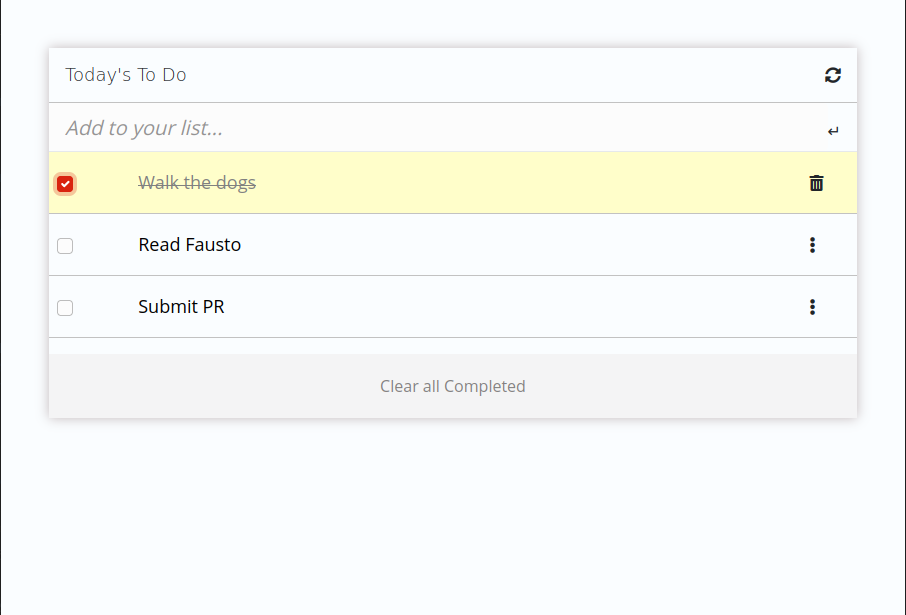
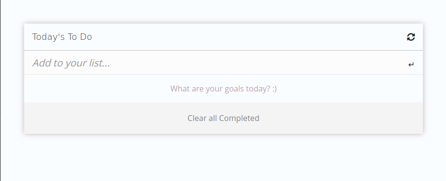

# My To-Do List

A Simple HTML list of To Do tasks built using webpack and served by a webpack dev server. 

## Project Goals 
  
  Demonstrate ability to:
  - Use webpack to bundle JavaScript.
  - Use proper ES6 syntax.
  - Use ES6 modules to write modular JavaScript.




## Built With

- HTML5
- CSS3
- JavaScript
- Webpack

## Live Demo

[Live Demo Link](https://alef-garrido.github.io/myToDoList/)

## How to use this repo

To get a local copy running follow this steps!

- Clone this repo.
- npm install to install the packages
- npm run start to build dist files and run local server.
- Run tests

To run the test just use the following command!

```
  npm test
```

You are good to go! 

## Author

👤 Alef Garrido

- GitHub: [lef-garrido](https://github.com/alef-garrido)
- Twitter: [Alef_Garrido](https://twitter.com/Alef_Garrido)
- LinkedIn: [alef-g](https://www.linkedin.com/in/alef-g/)

## Thanks to

- Microverse 
- Bootswatch

## :handshake: Contributing
Contributions, issues, and feature requests are welcome!

## Show your support
Give a star if you like this project!

## :memo: License
This project is MIT licensed.